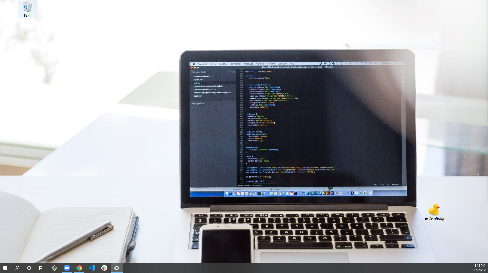
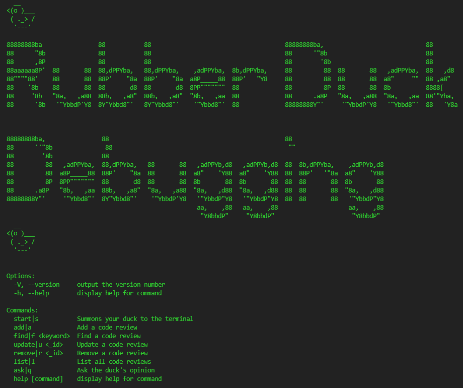

# RUBBER DUCKY CLI  &nbsp; [](https://opensource.org/licenses/MIT)

## DESCRIPTION
Why keep a rubber ducky by your desktop computer when you can keep it on your computer's desktop? This CLI allows you to do rubber duck debugging within the terminal, replacing the need for a physical rubber ducky! 



## TABLE OF CONTENTS
   [Installation](#installation) <br>
   [Usage](#usage) <br>
   [License](#license) <br>
   [Author](#author) <br>

<br>

## INSTALLATION

On your desktop, or a directory of your choice, clone the Rubber Ducky CLI's repository:

```
$ git clone https://github.com/DesmondAldridge/rubber-ducky-cli.git
```

Navigate into the newly created local directory, and run the npm installation:

```
$ cd rubber-ducky-cli
$ npm install
```

Lastly, create a symlink:

```
$ npm link
```
If you prefer, you may sever the symlink after use:

```
$ npm unlink
```
<br>

### And now for the proverbial question...
> Can a rubber ducky truly be a rubber ducky if only proverbial?
>
### In other words... 
> Shouldn't access to your rubber ducky CLI come in the form of an accessible and - more importantly - RECOGNIZABLE rubber ducky?
>
### In other other words... 
> The CLI directory itself should appear as a rubber ducky on your desktop (or in which ever designated directory you've elected to clone the repo).

<br>

<center></center>

<br>

### Here's how we accomplish that:

<br>

>STEP 1: Right click (Ctrl key in MAC) the CLI's newly cloned directory folder, and select 'Properties' at the bottom of the drop down menu.
>

<br>

<center></center>

<br>
<br>

>STEP 2: Go to the 'Customize' tag and select 'Change Icon'.
>

<br>

<center></center>

<br>
<br>

>STEP 3: Select 'Browse'.
>

<br>

<center></center>

<br>
<br>

>STEP 4: Navigate to the CLI's directory, where you will find a rubber ducky icon. Select it.
>

<br>

<center></center>

<br>
<br>

### THEN...
>The Rubber Ducky CLI's directory folder should now appear as a rubber ducky on your desktop (or in which ever designated directory you've elected to clone the repo)!
>
<br>

<center></center>

<br>


## USAGE

### Summon a digital rubber ducky to your terminal so that you may carry on with your verbal code review all within the virtual arena on screen. If you wish to document particular issues and their subsequent solution, you may do so by entering them into the rubber ducky's database. The option to search, update, and even remove prior entries are also available to you.
<br>

### Lastly, if you wish for your digital rubber ducky to respond you simply need ask with the proper CLI command.
<br>

### Instructions are as follows...

<br>



<br>

### Whether in your IDE's integrated terminal or an outside instance - and from any directory of your choosing - access the rubber ducky shell by invoking the following commands:
<br>

Title and instructional screen.
```
$duck
```
<br>

Summons your duck to the terminal.
```
$duck start
```
```
$duck s
```
<br>

Add a code review.
```
$duck add
```
```
$duck a
```
<br>

Find a code review.
```
$duck find <name or date>
```
```
$duck f <name or date>
```
<br>

Update a code review.
```
$duck update <_id>
```
```
$duck u <_id>
```
<br>

Remove a code review.
```
$duck remove <_id>
```
```
$duck r <_id>
```
<br>

List all code reviews.
```
$duck list
```
```
$duck l
```
<br>

Ask the duck's opinion.
```
$duck ask
```
```
$duck q
```

<br>

## LICENSE
[](https://opensource.org/licenses/MIT)

<br>

## AUTHOR
🎭Desmond Aldridge🎬<br>
>https://github.com/DesmondAldridge

